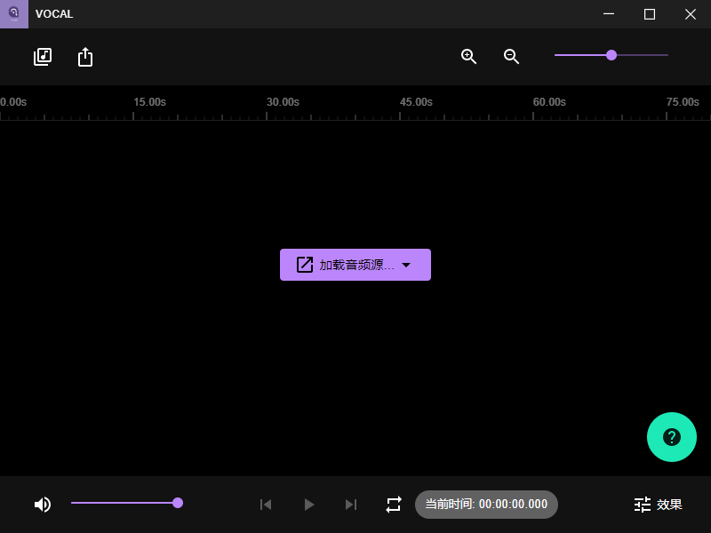
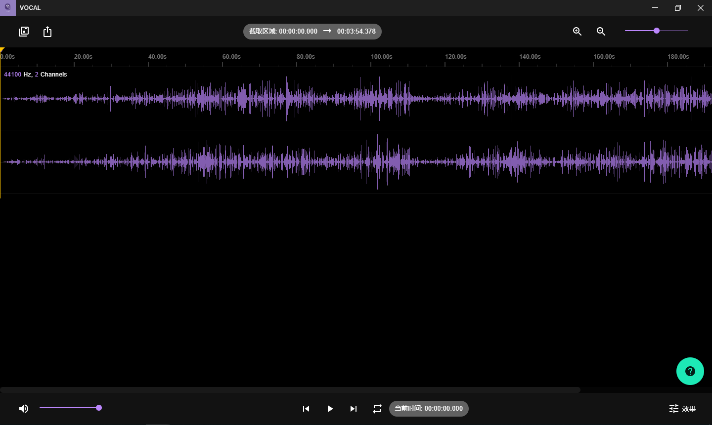
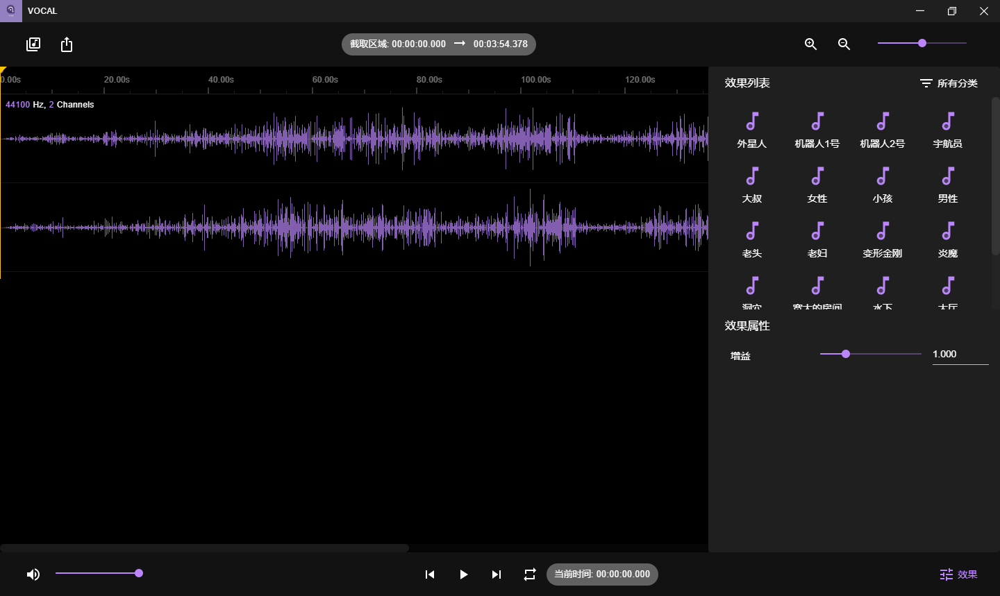
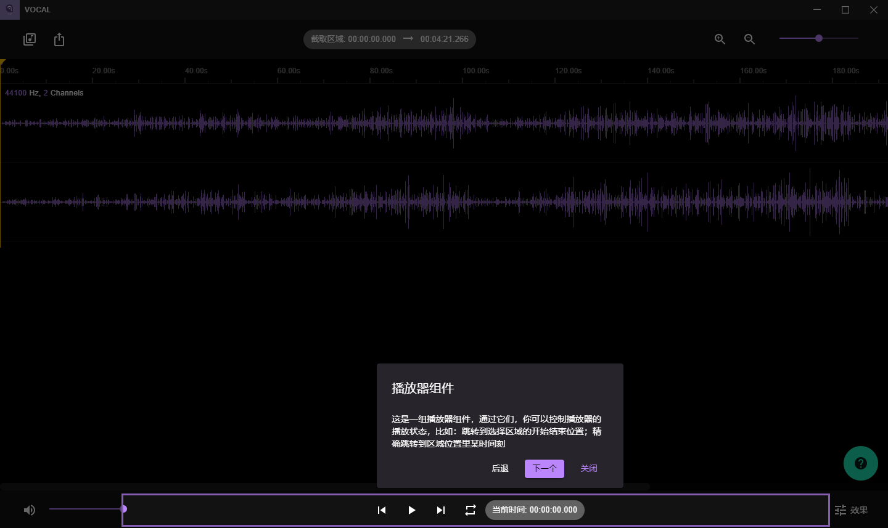

# vocal
Vocal is an cross-platform voice changer.

## Tech stack
- React + Redux + Redux-Saga + Typescript
- Web Worker
- Electron

## Usage

### Install dependencies
    yarn

### Run in web platform

    npm run dev

### Run in desktop platform
    // Run renderer process
    npm run dev:renderer

    // Run main process 
    npm run dev:main

### Build

    npm run build:desktop

    // Package windows os application
    npm run pack:win

    // Package macos application
    npm run pack:mac

## Screenshots

## License
The project is under MIT license